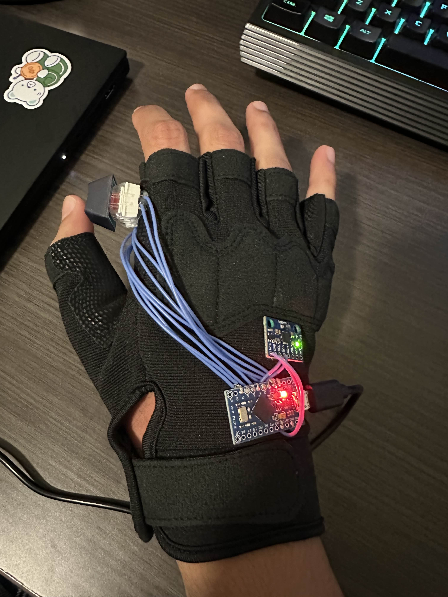
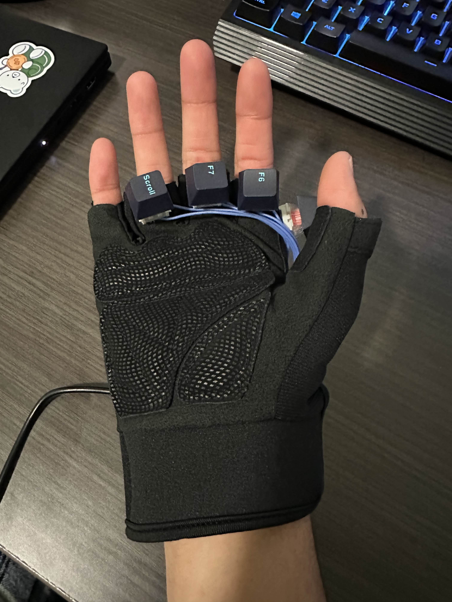

# Glove Mouse

A wearable glove alternative to the traditional computer mouse using an Arduino Pro Micro and MPU-6050 sensor. It detects hand motion and orientation to move the cursor, with buttons for clicks and a re-center button.

## Overview
The Glove Mouse is designed as both an accessibility-focused device and an enhancement to standard mouse input. Instead of dragging a mouse across a surface, users simply rotate their hand in 3D space. Gyroscope data is processed into stable 2D cursor motion using deadzones, filtering, and drift-correction. Mechanical switches provide reliable left-click, right-click, scroll/middle-click, and re-centering. This design reduces wrist strain, avoids repetitive motions that contribute to carpal tunnel syndrome, and enables more intuitive interaction modes than a traditional 2D mouse.

  
  &nbsp;&nbsp;&nbsp;&nbsp;&nbsp;&nbsp;&nbsp;&nbsp;
  

## Components
- Arduino Pro Micro (ATmega32U4)
- MPU-6050 IMU sensor
- 4 mechanical switches
- Glove for mounting hardware
- Flexible wiring, hot glue

## Features
- 3D motion tracking → smooth, drift-free cursor movement  
- Left-click, right-click, scroll, and re-center buttons  
- USB HID → works as a native mouse on any computer  
- Comfortable wearable design
